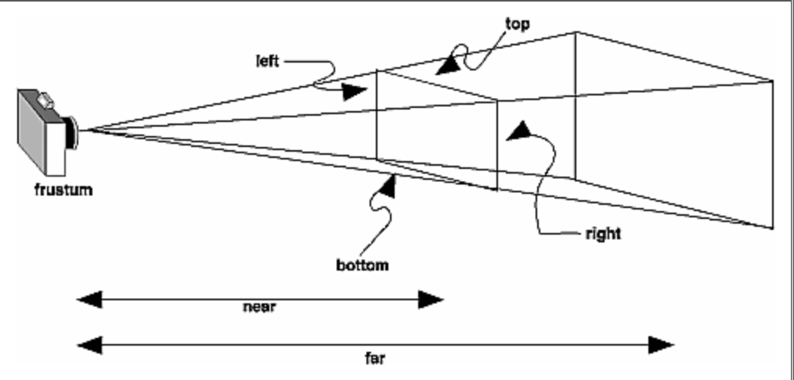

对于OpenGL ES2，有两个函数来实现视图变换和投影变换以及正交变换，这里来详细理解一下这两个函数的参数

下图给出投影变换的示意图

    Matrix.frustumM(mProjMatrix, offset, left, right, bottom，top, near, far);

上面这张图给出了各个参数的意义。mProjMatrix是要生成的投影矩阵
下图给出正交投影示意图

    Matrix.orthoM(mOrthoMatrix,mOffset,left,right,bottom,top,near,far);

上图给出了各个参数的意义，mOrthoMatrix就是得到正交矩阵

    Matrix.setLookAtM(mVMatrix, offset, eyex,eyey,eyez,centerx, centery, centerz, upx, upy, upz);

eye 表示 camera/viewer 的位置， center 表示相机或眼睛的焦点（它与 eye 共同来决定 eye 的朝向），而 up 表示 eye 的正上方向，注意 up 只表示方向，与大小无关。

Matrix.setLookAtM(mVMatrix,0,0f,0f,5f,//相机坐标

0f,0f,0f,//目标坐标

0.0f,1.0f,0.0f);//相机正上方向量