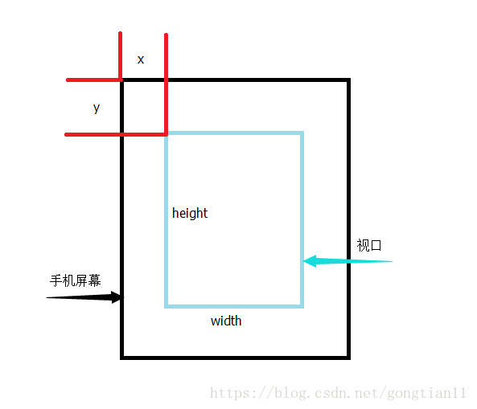
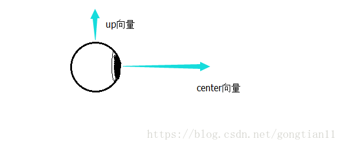
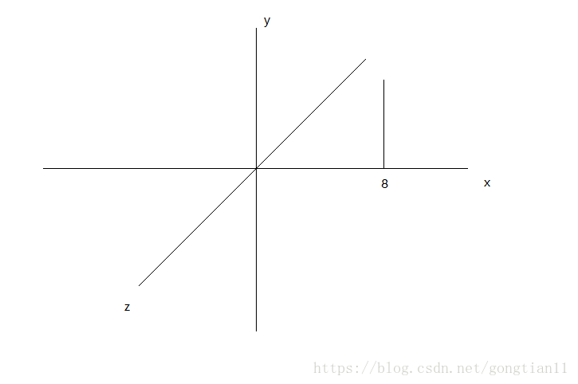

本文内容为在绘制之前，设置相机和投影矩阵的一些基本内容

在绘制图形时,onSurfaceChanged中需要设置视口、相机矩阵、投影矩阵.
一般运行结果不报错但是屏幕上只有背景色就很有可能是这部分出错了。结果不报错说明图形绘制成功，但是屏幕上没有显示说明图形没有画在用户可见区域内，而onSurfaceChanged所做的这几步操作就是用来设置在整个空间坐标系中，用户能看到的部分。

 一般在onSurfaceChanged中会进行三步操作

   1、设置视口

    调用的函数为：GLES20.glViewport(int x, int  y, int width, int height);

 如上图所见，x，y为视口左上角在手机屏幕中的坐标位置，width，height为视口的宽和高。

   2、设置相机矩阵

      Matrix.setLookAtM(mVMatrix, offset, eyex,eyey,eyez,centerx, centery, centerz, upx, upy, upz);

 eye的X,Y,Z表示空间中，相机的位置，center的X,Y,Z表示相机的正方向的方向向量，up的X,Y,Z表示相机的上方向的方向向量。

因为空间中想要确定一个具体朝向，必须要有两组向量，所以此函数需要一个点和两组向量来确定相机的位置和具体朝向。

3、设置投影矩阵

  OpenGL ES中，有两个函数来实现视图变换和投影变换以及正交变换,投影分为两种，一种叫做正交投影，一种叫做透视投影。

  透视投影比较符合我们人眼的生理习惯，也就是会形成远小近大的效果，而正交投影的效果是远近的视觉效果都是一样大。

下图给出透视投影变换的示意图 ：

    Matrix.frustumM(mProjMatrix, offset, left, right, bottom，top, near, far);

    正交：
    Matrix.orthoM(mOrthoMatrix,mOffset,left,right,bottom,top,near,far);

几个方向参数分别表示近平面的左右上下的大小，near表示近平面距视点（就是上面的那个相机）的距离，far表示远平面距视点的距离。
只有绘制在近平面和远平面之间的内容，才能被用户看到。

案例 举个简单的案例说明一下效果。

    空间中，在x轴为8的位置画一条竖线。如果设置各矩阵参数

    eye：0,0,0,    center：1,0,0,       up：0,1,0    near: 1     far : 10 看到的结果会是一条竖线，在屏幕上半面

    eye：0,0,0,    center：-1,0,0,       up：0,1,0    near: 1     far : 10 看到的结果会是只有背景颜色，因为视野方向正好和图形方向相反。

    eye：0,0,0,    center：1,0,0,       up：0,-1,0    near: 1     far : 10 看到的结果会是一条竖线，在屏幕下半面

    eye：0,0,0,    center：1,0,0,       up：0,0,1    near: 1     far : 10 看到的结果会是一条横线，在屏幕左半面

    eye：0,0,0,    center：1,0,0,       up：0,0,-1    near: 1     far : 10 看到的结果会是一条横线，在屏幕右半面

    eye：0,0,0,    center：-1,0,0,       up：0,1,0    near: 9     far : 10 看到的结果会是只有背景颜色，因为画在了近平面和视点之间。

    eye：0,0,0,    center：-1,0,0,       up：0,1,0    near: 1     far : 7 看到的结果会是只有背景颜色，因为画在了远平面之外

